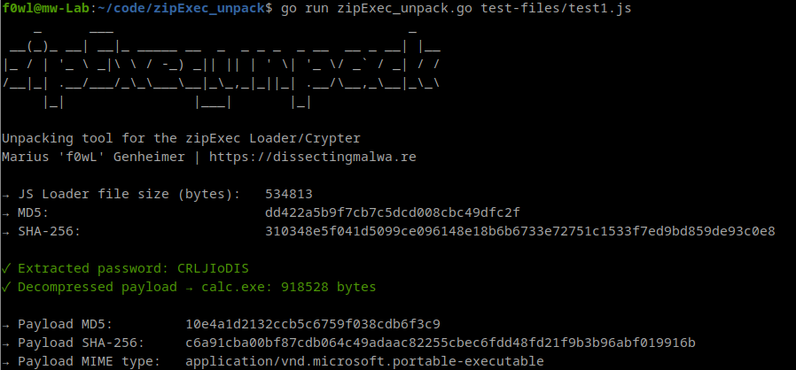

# zipExec_unpack

A simple unpacking tool for the [zipExec Crypter](https://github.com/Tylous/ZipExec) by Tylous. Since this Crypter will likely be used for malicious purposes sooner rather than later I chose to write this unpacking script and a matching [Yara rule](https://github.com/f0wl/yara_rules/blob/main/windows/crypter/zipExec-crypter.yar) to detect the usage of zipExec. The samples in ```test-files/``` are crypted versions of the Windows Calculator application```calc.exe```.

### Usage

```shell
go run zipExec_unpack.go path/to/sample.js
```

## Screenshot
